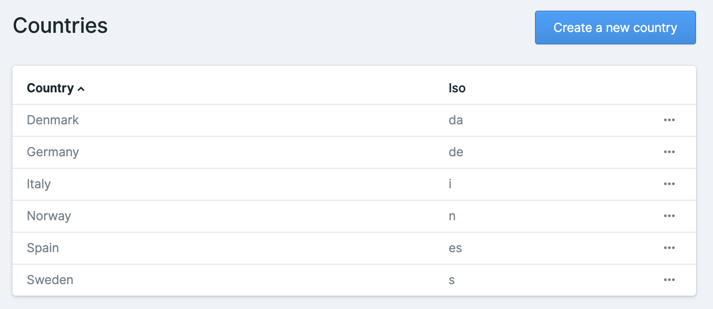
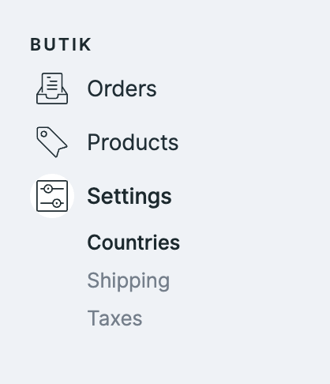

# Countries

## Default Country

Before you can sell products, you need to set up **at least one country**. 

We did set up one default country through the installation process, which should get you started. 


You can easily manage your countries in the butik settings.


## Countries will define which countries you can ship to

Create all the countries, you would like to sell your products to.  When setting up your shipping zones, it will be possible to connect your countries to them. 

If you want to ship to a specific country, make sure you did create the country.

Read more about the shipping process and how everything is connected



