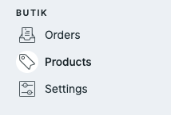
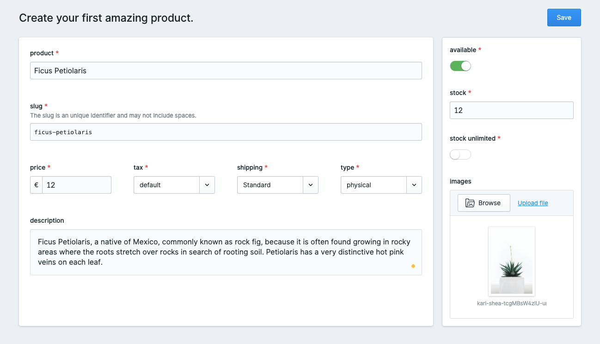
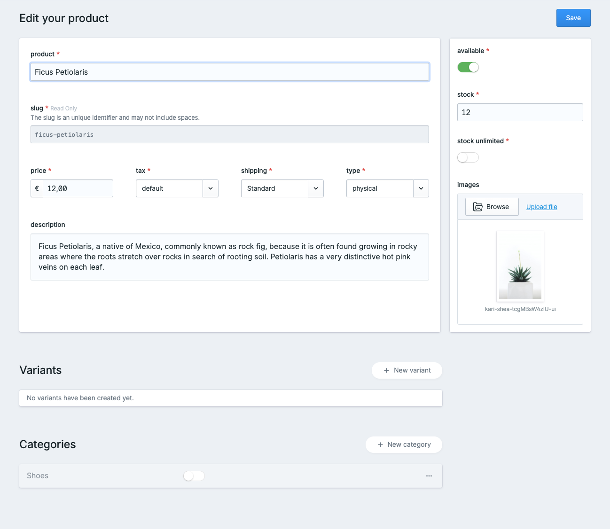
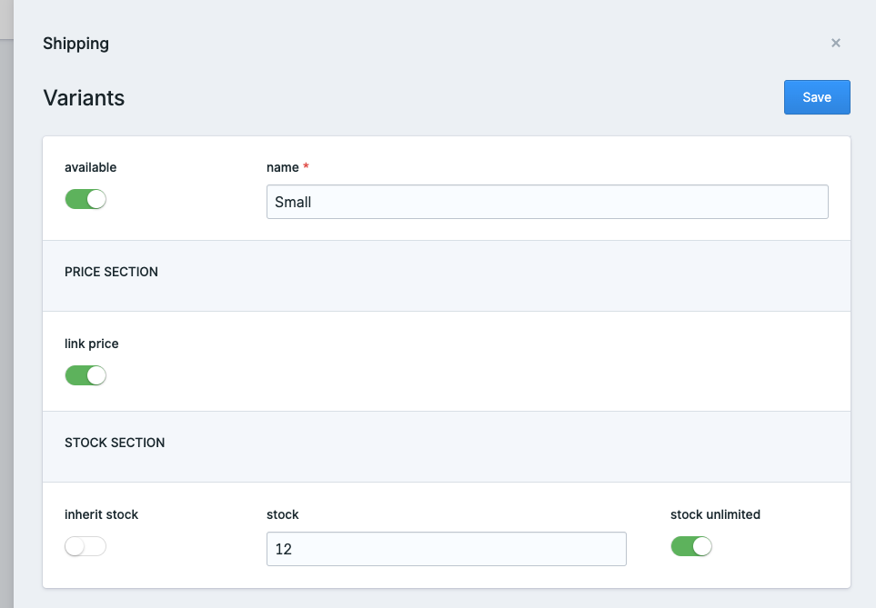
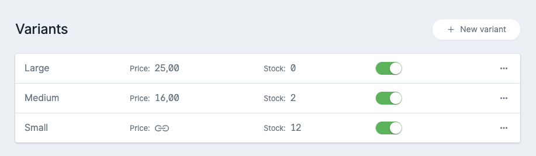
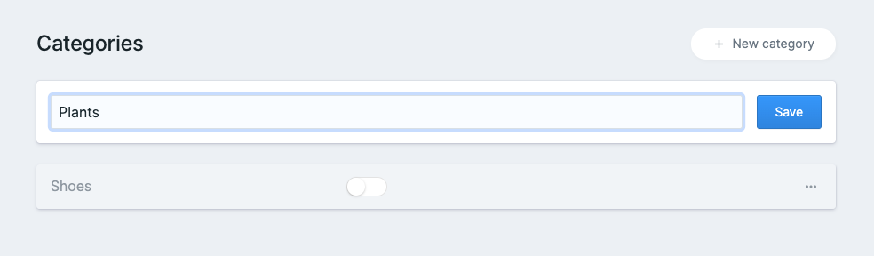
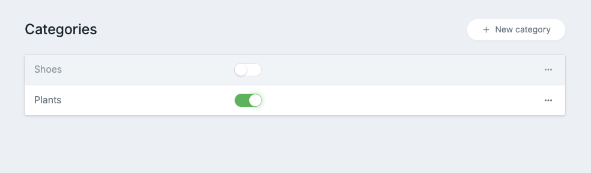

# Products

## Manage

You can manage all of your products and stock in Statamics control panel.

## Create a new product

To create a product, simply fill out all fields with a red little star. 

<table>
  <thead>
    <tr>
      <th style="text-align:left">Field</th>
      <th style="text-align:left">Description</th>
    </tr>
  </thead>
  <tbody>
    <tr>
      <td style="text-align:left">product</td>
      <td style="text-align:left">The product name</td>
    </tr>
    <tr>
      <td style="text-align:left">slug</td>
      <td style="text-align:left">
        
A unique identifier for the product, which will be used to create the
          product url.

        
<em>butik will bark if the slug has already been taken.</em>
        

      </td>
    </tr>
    <tr>
      <td style="text-align:left">price</td>
      <td style="text-align:left">Product price including taxes</td>
    </tr>
    <tr>
      <td style="text-align:left">tax</td>
      <td style="text-align:left">The <a href="https://butik.dev/configuration/taxes">tax </a>to use on this
        product</td>
    </tr>
    <tr>
      <td style="text-align:left">shipping</td>
      <td style="text-align:left">The <a href="https://butik.dev/configuration/shipping#shipping-profiles">shipping profile</a> connected
        with this product</td>
    </tr>
    <tr>
      <td style="text-align:left">type</td>
      <td style="text-align:left">Right now there is only physical available. Soon it will be possible to
        sell digital products as well.</td>
    </tr>
    <tr>
      <td style="text-align:left">description</td>
      <td style="text-align:left">The description shown for this product.</td>
    </tr>
  </tbody>
</table>

| Field | Description |
| :--- | :--- |
| available | If deactivated, the product can't be bought and won't show in the shop. |
| stock | How many are available |
| stock unlimited | Do there exist unlimited amounts of this product? Be careful with this setting ... |
| images | Beautiful images will help to sell your product. |

## Edit an existing product

After you did save your product, you will be redirected to the edit view of your product.

This view is nearly identically with the create screen. Variants and categories can be edited from here as well. No hassle jumping to different views to edit a category, variant or similar.  

##  Variants

You can create different variants for your existing products. This might be useful for different cases, like selling t-shirts in different sizes. 

### Create a new variant

| Field | Description |
| :--- | :--- |
| **available** | If deactivated, this variant can not be bought or won't be shown |
| **name** | Choose a short and clear name for your variant |
| **link price** | Do you want to inherit the price or use another price? |
| **price** | Will only show if prices are not linked |
| **inherit stock** | Do you want to inherit the stock from your parents? |
| **stock** | Only visible if not inherited from the parent |
| **stock unlimited** | Do you have unlimited products? Be careful with this setting |

### Manage existing variants

## Categories

Your shop does work perfectly without any categories. In case youre having a lot of product, categories will help your customers to find faster what they need. 

### Create a new category

 Simply create a new category when editing your product itself. 

### Manage existing categories

Use the toggles to connect your product to one or multiple categories. That's everything there is to it. 


As soon as you add any category, links will get visibly in our default shop templates to browse products in the belonging categories.


