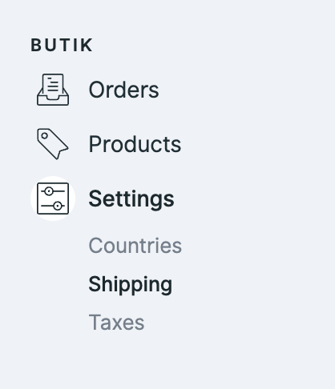
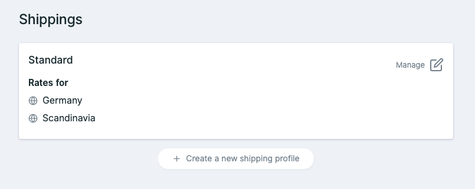
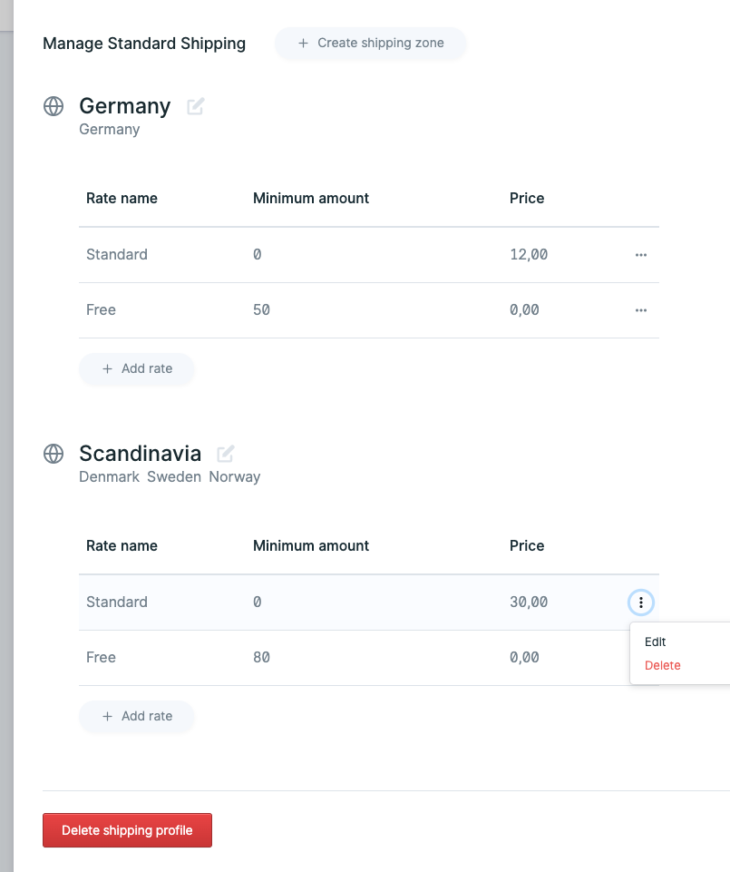
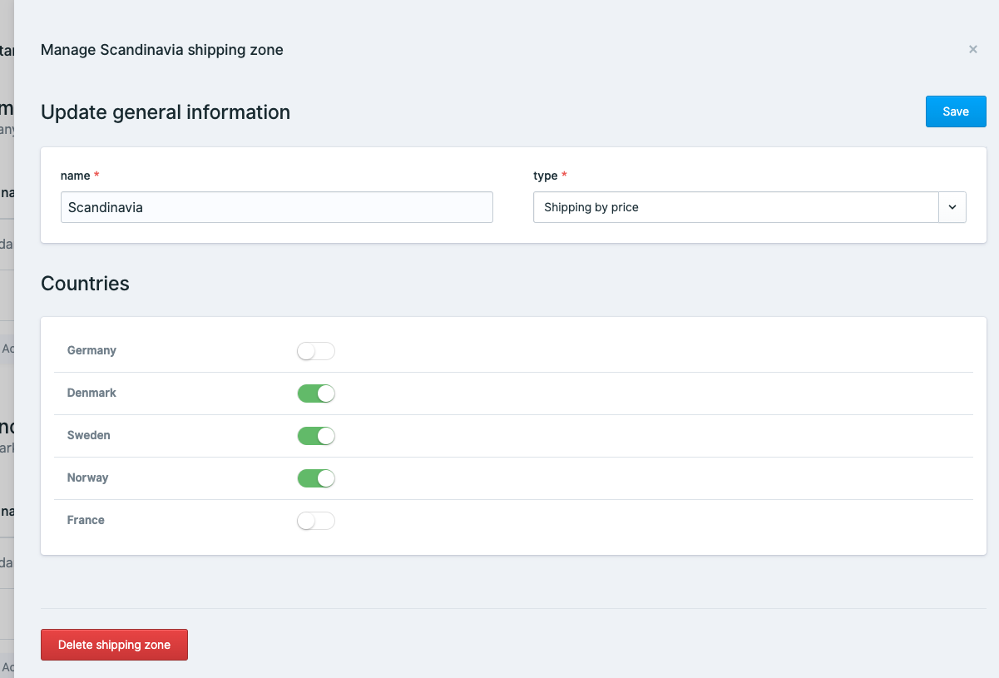

# Shipping

Your Shipping settings can be kept simple or really complex if you need them to bet. 

## Shipping Profiles

A shipping profile is the connection between your product and the calculation of the shipping price. You need to choose one shipping profile for each product.

Each shipping profile has it's own [shipping zones](https://butik.dev/configuration/shipping#shipping-zones) and [rates](https://butik.dev/configuration/shipping#shipping-rates). This gives you the flexibility to decide where your products can be bought and what you want to charge for shipping.


You only need exactly one profile. 


### Use case 1: T-Shirt shop

Let's assume you own a shop, only selling t-shirts. The got different colors, sizes and prices, but the shipping costs are the same per T-Shirt. 

No need for more than one Shipping profile. 

### Use case 2: Surf shop

A surf shop might sell t-shirts as well, with the same shipping requirements as the t-shirt shop, but what if they want to sell surfboards as well?

Surf boards are fragile goods, do need some special kind of shipping which is much more expensive.

In that case, a second shipping profile named »Fragile« might be handy, so you can differentiate between »standard t-shirt« and »fragile surfboard« shipping, charge different prices for them and restrict the countries you are selling them to if this does benefit you. 

##  Shipping Zones

Shipping zones are grouping countries, to save yourself a lot of time and making managing different zones easier.

This shipping profile has two shipping zones.

| Zone name |  |
| :--- | :--- |
| **Germany** | Only containing one country, which often might be your home or default country to ship to. |
| **Scandinavia** | Does contain Denmark, Sweden and Norway assuming the shipping costs are nearly the same to ship to.  |

As you can see, we did define different shipping costs for those zones. 

### Connect countries

To edit a shipping zone, you'll find the edit symbol beside the shipping zone name.

This is the place to connect or disconnect existing countries to your shipping zone.


Every country can only be connected to one shipping zone per shipping profile. 

butik will let you know if you're trying otherwise. 


### Use case 1: T-Shirt shop

The connected countries in the image above \(Denmark, Sweden and Norway\) might make sense if you want to ship to scandinavia. 

Germany might be excluded, because having it's one shipping zone.   
France might be excluded, because you don't want to sell to France right now.

### Use case 2: Surf shop

Selling surfboards abroad might be really expensive and complicated. In that case, you might only create one shipping profile with your home country only. 


_butik_ will show your users automatically through the checkout process if they can't buy certain items. 


## Shipping Rates

Easily create, edit or delete shipping rates. 

It's a common use case to charge for shipping, unless your customers buy for at least amount X. 

You can name your shipping rates as you prefer

### Use case 1: Germany

| Rate |  |
| :--- | :--- |
| **Standard** | With a minimum amount of zero, this is the first shipping rate applying automatically. Your customers will be charged 12 in total. |
| **Free** | As soon as all products in the shopping bag do exceed to a minimum amount of 50, your customers will get free shipping. |

### Use case 2: Scandinavia

The system is the same as for Germany, besides the shipping costs for your customer does start at 30.

As soon as somebody is buying items for more than 80 in total, the free shipping costs will apply as well.

### Buying items from different shipping profiles


The calculated shipping costs will be separated by their belonging shipping profiles. 


What does that mean?

**Let's go back to our surf shop example:**  
A customer could buy so many t-shirts, that shipping would be free for all of them. 

By adding a surfboard to his shopping bag, which does belong to another shipping profile, he will probably pay shipping costs for it. 

The shipping costs for his t-shirts would be free, but he has to pay shipping for his surfboard only.

